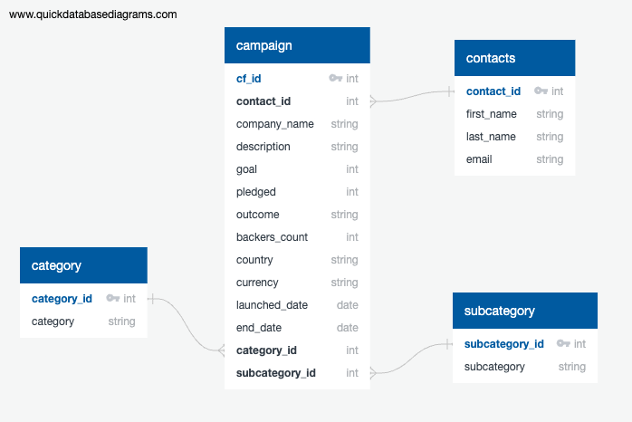
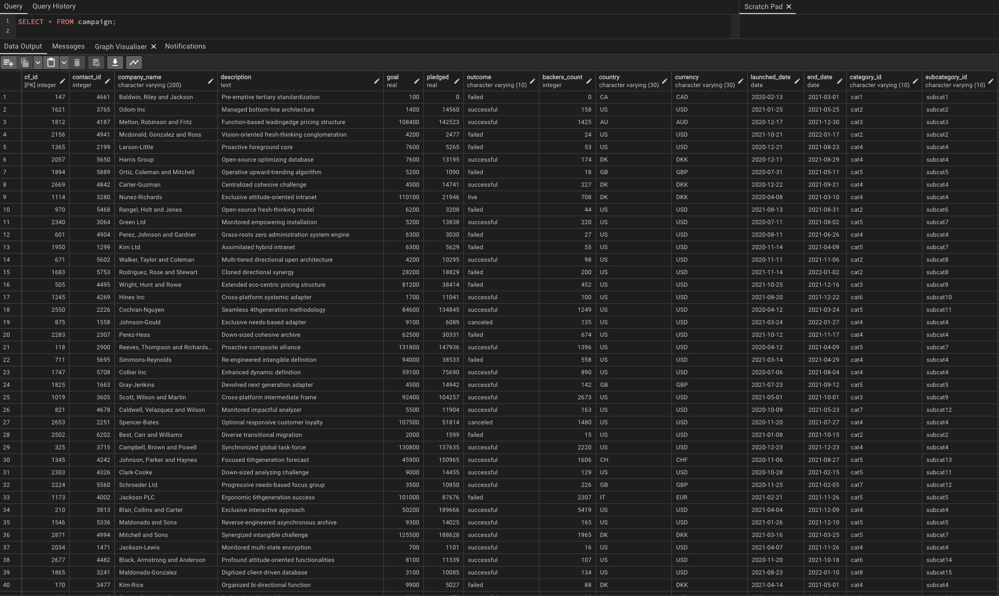
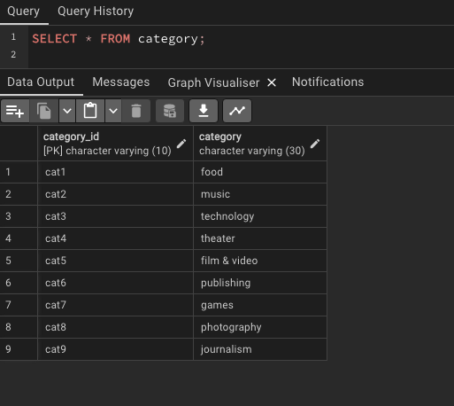
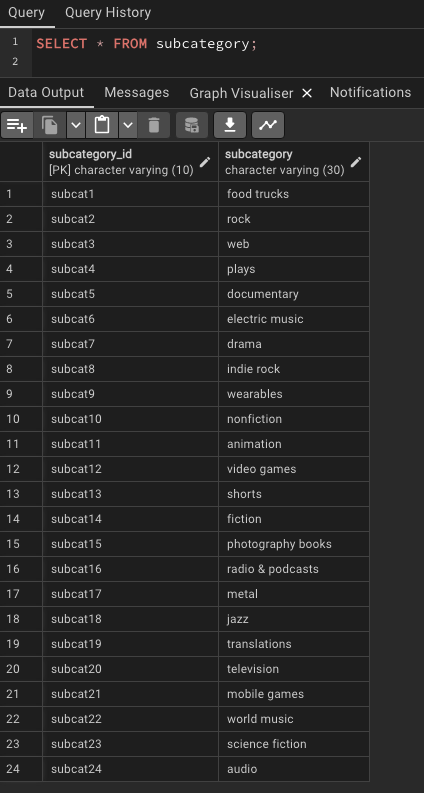
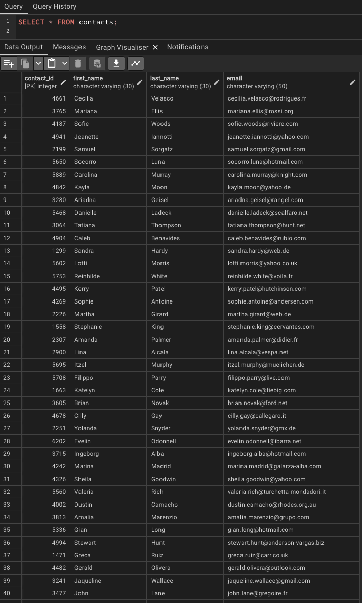

# Crowdfunding_ETL
Analytics Bootcamp Project 2

## Problem Set
For the ETL mini project, we work with a partner/group to practise building an ETL pipeline using Python, Pandas, and either Python dictionary methods or regular expressions to extract and transform the data. After we transform the data, we'll create four CSV files and use the CSV file data to create an ERD and a table schema. Finally, we will upload the CSV file data into a Postgres database.

## Deliverables
- A python Jupyter notebook that details all the "extract" and "transform" steps and methods
- Four extracted csv files that contain:
  - campaign details
  - category details
  - sub-category details
  - contact details
- A PostgreSQL database demonstrating the successful import of the csv files.

## Resources and Outputs
- Input data files:
  - `Resources/crowdfunding.xlsx`
  - `Resources/contacts.xlsx`
- Python Jupyter notebook: `ETL_Mini_Project.ipynb`
- Extracted and cleansed csv files:
  - `Resources/campaign.csv`
  - `Resources/category.csv`
  - `Resources/subcategory.csv`
  - `Resources/contacts.csv`
- SQL database schema: `crowdfunding_db_schema.sql`
- Images demonstrating PostgreSQL database generation:
  - `images/ERD_campaign.png`
  - `images/table_campaign.png`
  - `images/table_category.png`
  - `images/table_subcategory.png`
  - `images/table_contacts.png`

## ETL Snapshots
The snapshot below demonstrates the ERD concept for structuring the crowdfunding database

The following snapshots illustrate the various tables and queries used to visualise the database tables. The tables are campaign, category, subcategory and contacts.

